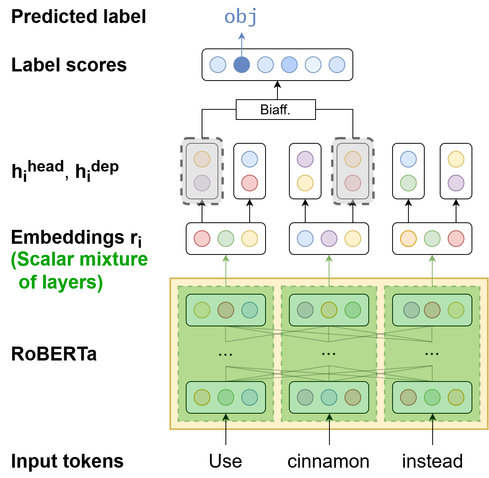

# RobertNLP Enhanced UD Parser

[](LICENSE)

This repository contains the companion code for RobertNLP, the [Enhanced Universal Dependencies](
https://universaldependencies.org/u/overview/enhanced-syntax.html) parser described in the paper

> [Stefan Grünewald and Annemarie Friedrich (2020): **RobertNLP at the IWPT 2020 Shared Task:
Surprisingly Simple Enhanced UD Parsing for English.** Proceedings of IWPT 2020.](
https://iwpt20.sigparse.org/pdf/2020.iwpt-1.26.pdf)

The code allows users to reproduce and extend the results reported in the study.
Please cite the above paper when using our code, and direct any questions or 
feedback regarding our parser at [Stefan Grünewald](mailto:stefan.gruenewald@de.bosch.com).

### Disclaimer: Purpose of the Project

This software is a research prototype, solely developed for and published as
part of the publication cited above. It will neither be maintained nor monitored in any way.




## Project Structure

The repository has the following directory structure:
```
robertnlp-enhanced-ud-parser/
    configs/                            Example configuration files for the parser
    data/
        corpora/                        Folder to put training/validation UD corpora
            ewt/                        Folder for EWT corpus files
                vocab/                  Vocabulary files for EWT corpus
                download_ewt.sh         Script for downloading EWT corpus files
            delexicalize_corpus.py      Script for replacing lexical material in dependency labels with placeholders in an English UD corpus
        pretrained-embeddings/          Folder for pre-trained word embeddings
            download_embeddings.sh      Script for downloading pre-trained word embeddings
        saved_models/                   Folder for saved models
            download_models.sh          Script for downloading trained parser models (forthcoming)
    src/
        data_handling/                  Code for processing dependency-annotated sentence data
        logger/                         Code for logging (--> boring)
        models/                         Actual model code (parser, classifier)
            embeddings/                 Code for handling contextualized word embeddings
        pre_post_processing/            Dependency graph pre-/post-processing (as used in IWPT 2020 Shared Task)
        trainer/trainer.py              Training logic
        init_config.py                  Initialization of model, trainer, and data loaders
        parse_corpus.py                 Main script for parsing corpora using a trained model
        train.py                        Main script for training models
    environment.yml                     Conda environment file for RobertNLP
    parse_raw_text.sh                   Script for parsing from raw text with heuristic post-processing (as used in Shared Task)
```


## Using the Parser

### Requirements
**RobertNLP itself** requires the following dependencies:
* [Python](https://www.python.org/) >= 3.7.5
* [PyTorch](https://pytorch.org/) >= 1.3.1
* [Huggingface Transformers](https://github.com/huggingface/transformers) >= 2.3.0
* [PyConll](https://github.com/pyconll/pyconll/) >= 2.2.1

If you also want to perform the **pre- and post-processing steps** outlined in [our paper](https://iwpt20.sigparse.org/pdf/2020.iwpt-1.26.pdf),
you will additionally need the following dependencies:
* [StanfordNLP](https://github.com/stanfordnlp/stanfordnlp)
* [AllenNLP](https://github.com/allenai/allennlp/)
* [UDify](https://github.com/Hyperparticle/udify/) (**manual download required**)

With the exception of UDify, you can install all of the above dependencies easily using [Conda](https://docs.conda.io/en/latest/)
and the ```environment.yml``` file provided by us:
```bash
conda env create -f environment.yml
conda activate robertnlp
```

For UDify, clone [their repository](https://github.com/Hyperparticle/udify/) into a location of your choice and [download
their trained model](https://lindat.mff.cuni.cz/repository/xmlui/handle/11234/1-3042) (```udify-model.tar.gz```) into a location of
your choice. Then, see [the section below](#reproducing-full-iwpt-approach) for how to integrate the system into the parsing pipeline.


### Downloading Training Data and Pre-trained Embeddings
For simplicity, we have added scripts for downloading training/validation corpora as well as the pre-trained language models used in our system.

For the training/validation data ([EWT corpus](https://github.com/UniversalDependencies/UD_English-EWT)), use:
```bash
cd data/corpora/ewt/
./download_ewt.sh
```

For the pre-trained language models, use:
```bash
cd data/pretrained-embeddings/
./download_embeddings.sh
```

**Note:** Since the model files are quite large, the downloads might take a long time depending on your
internet connection. You may want to edit the download scripts in order to download only the particular
models you are actually interested in (see comments in the respective scripts).


### Training Your Own Model
To train your own parser model, run ```python src/train.py [CONFIG_PATH]```.  
**Example:** ```python src/train.py configs/roberta-base-768d.json```.

If you are using one of the configuration files provided in this repository, the model checkpoints will be written
to ```saved_models/models/[MODEL_NAME]/[TIMESTAMP]/checkpoint_epochX.pth``` (where ```X``` is the epoch number).
The same folder will also contain the ```config.json``` that can then be used to load the model.


### Parsing a Pre-processed Corpus
To parse a corpus of (segmented, pre-tokenized) sentences, run one of the following commands from the root directory of this repository:
1. If your corpus is in text format (whitespace-tokenized, one sentence per line):
```python src/parse_corpus.py [CONFIG_PATH] [SAVED_MODEL_PATH] [CORPUS_PATH]```
2. If your corpus is in [CoNLL-U format](https://universaldependencies.org/format.html):
```python src/parse_corpus.py --conllu [CONFIG_PATH] [SAVED_MODEL_CHECKPOINT_PATH] [CORPUS_PATH]```

Parsed sentences will be written (in CoNLL-U format) to ```stdout```.

> **Example:** If you've trained a model based on the ```roberta-large-1024d.json``` config and want to parse the
> development section of the EWT corpus using it, run:
> ```bash
> python src/parse_corpus.py --conllu data/saved_models/models/RoBERTa_large_1024d/[TIMESTAMP]/config.json
>                                     data/saved_models/models/RoBERTa_large_1024d/[TIMESTAMP]/model_best.pth
>                                     data/corpora/ewt/en_ewt-ud-dev.conllu
> ```

**Note 1:** Only the enhanced dependencies column will contain actual parser output. The basic dependency columns
will be filled with placeholders, and the other columns (e.g. POS, lemma) will be left blank.

**Note 2:** Parsing corpora with this script will **not** perform any pre-processing (tokenization and sentence
segmentation); the script expects tokenized and segmented text as input. Neither will it perform the heuristic
post-processing "graph repair" steps described in our paper, which rely on the output of an external parser.
A small number of the resulting dependency graphs may therefore be structurally invalid (i.e., contain nodes which cannot
be reached from the root of the sentence). To reproduce our post-processing steps for the IWPT test data,
please refer to the corresponding section below.


### Reproducing Full IWPT Approach
To exactly reproduce the approach used for our official submission to the IWPT 2020 Shared Task (including pre-processing
and post-processing), follow these steps:

* Train a model using the ```roberta-large-1024d.json``` config.
* Open the ```parse_raw_text.sh``` script in the main directory of this repository and set the values of ```UDIFY_PATH```
  and ```UDIFY_ARCHIVE_PATH``` to the respective locations on your hard drive.
* Run ```parse_raw_text.sh```, providing a config file, a model checkpoint, and the raw text file you wish to parse, e.g.:
  ```
  ./parse_raw_text.sh data/saved_models/models/RoBERTa_large_1024d/[TIMESTAMP]/config.json data/saved_models/models/RoBERTa_large_1024d/[TIMESTAMP]/model_best.pth [RAW_TEXT_FILE]
  ```

The script will first tokenize and sentence-segment the input text file using StanfordNLP, then parse the tokenized text
using your trained model, and finally post-process the resulting dependency graphs using UDify.
Output of the parsing process will be written (in CoNLL-U format) to a new file ```parsed.conllu```.


## License

The RobertNLP parser is open-sourced under the BSD-3-Clause license. See the [LICENSE](LICENSE)
file for details.

For a list of other open source components included in RobertNLP, see the
file [3rd-party-licenses.txt](3rd-party-licenses.txt).

The software, including its dependencies, may be covered by third party rights,
including patents. You should not execute this code unless you have
obtained the appropriate rights, which the authors are not purporting to
give.

